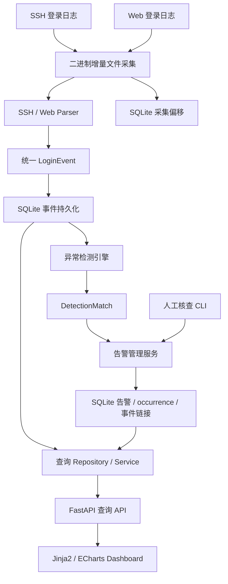

# Login Sentry

**登录异常监测与告警系统** · Python / FastAPI / SQLite / ECharts

## 1. 项目简介

Login Sentry 面向小型 Web 应用和 Linux 主机的登录安全场景，将 SSH 与 Web
登录日志转换为统一事件，完成增量持久化、异常检测、告警聚合、人工核查和可视化查询。

项目采用 SQLite 和同步一次性处理流程，无需外部数据库或消息队列。
当前已完成 **Stage 5：API 与 Dashboard**，适合用于理解和验证从原始日志到
可追溯告警的完整处理链路。许可证：[MIT](LICENSE)。

## 2. 系统架构



采集器负责文件读取，解析器负责规范化，检测器只生成匹配结果；独立告警服务处理
持久化、聚合和核查。API 通过 Service 与 Repository 查询 SQLite，路由中不包含 SQL。
事件与偏移更新使用同一事务；告警、occurrence 和事件链接也按 occurrence 原子提交。

## 3. 核心功能

### 3.1 日志采集与解析

- **SSH**：解析传统 syslog 格式的 Accepted password、Accepted publickey、
  Failed password，以及 invalid user 失败记录。年份和时区由调用者显式提供。
- **Web**：使用固定登录日志格式，支持 SUCCESS / FAILURE；时间必须包含时区。
- **统一模型**：不可变 `LoginEvent` 包含 timestamp、source_type、source_ip、
  username、result 和 raw_log。支持 IPv4/IPv6 规范化，时间为 timezone-aware datetime。
- **解析结果**：成功返回事件，无关行返回 `None`，损坏的目标日志抛出 `ParseError`。
  原始日志只去除末尾 CR/LF，保留其他内容用于追溯。

Web 示例（字段顺序固定，标记区分大小写）：

```text
2026-10-05T13:42:12+08:00 LOGIN username=alice ip=192.0.2.10 result=SUCCESS
```

时间支持 `Z` 或 `±HH:MM`，可带 1–6 位小数秒。用户名支持 ASCII 字母、数字及
`_`、`-`、`.`、`@`。仓库 [samples](samples) 使用虚构账号和文档示例 IP。

### 3.2 增量持久化

采集器以二进制方式读取 UTF-8 日志，持久化的是**字节偏移**，支持 LF/CRLF 和多字节字符。
末尾未换行的半条记录留待下次处理；无效 UTF-8 字节使用替换字符解码。
无关行与解析失败行分别计数并推进偏移，避免坏行永久阻塞。

| SQLite 表 | 职责 |
| --- | --- |
| `login_events` | 规范化事件与原始日志 |
| `collector_offsets` | 规范化绝对路径、inode 与下一读取字节位置 |
| `alerts` | 告警状态、时间范围、次数和核查备注 |
| `alert_occurrences` | 检测 occurrence 身份与告警归属 |
| `alert_event_links` | 告警与真实事件 ID 的关联 |

正常追加从已保存偏移续读；inode 改变或文件大小小于已保存偏移时从头读取当前文件。
事件插入与偏移更新同事务提交，数据库失败时一起回滚。重启后从 SQLite 恢复偏移，
避免重复采集；不会通过事件内容去重，因为相同内容可能代表不同登录尝试。

### 3.3 异常检测

| 规则 | 默认条件 | 默认冷却 |
| --- | --- | --- |
| `failure_burst` | 同一 IP 在 60 秒内至少 5 次登录失败 | 300 秒 |
| `multi_account` | 同一 IP 在 300 秒内失败尝试至少 4 个不同用户名 | 600 秒 |

两条规则都只计失败事件，SSH/Web 事件合并按 source_ip 分组。多个账号在共享 IP
下成功登录不会因此触发 multi_account；重复用户名不增加不同账号数。

时间窗口双端包含，恰好等于窗口长度时计入，多 1 微秒则移出。事件按 timestamp、ID
排序，使用滑动窗口与用户名计数表。首次达标后固定簇起点，纳入仍在窗口内的后续事件，
越界后开始新簇，形成有界、不重叠的贪心匹配，而非枚举所有重叠窗口。

[config/default.toml](config/default.toml) 提供 enabled、时间窗口、阈值和冷却参数。
每次加载配置后生效；缺字段、未知字段、错误类型以及非正整数均明确报错，bool 不作为整数接受。
检测本身只返回带真实事件 ID 的 `DetectionMatch`，不写告警。

### 3.4 告警管理

告警以稳定的 `rule_type|source_ip` 为 fingerprint，不同规则或 IP 分别管理。
failure_burst 严重度为 medium，multi_account 为 high。

- **聚合与冷却**：选择同 fingerprint 最新的 OPEN / CONFIRMED 告警；新匹配结束时间
  `<= last_seen + cooldown` 时聚合，边界包含，否则新建。
- **Occurrence 计数**：`occurrence_count` 表示不同检测匹配的数量，不是事件数量。
  first_seen 取最小值，last_seen 取最大值，乱序旧匹配不会让时间倒退。
- **SHA-256 幂等**：使用规则、IP、UTC 窗口起止和排序后的事件 ID 生成 occurrence key。
  相同匹配重复处理或进程重启不会重复计数；重叠事件链接取并集。
- **事务一致性**：告警更新、occurrence 和事件链接一起提交或回滚。
- **历史追溯**：通过事件链接查询真实 `LoginEvent` 与 raw_log，核查不会删除历史事件。

| 状态枚举 | 存储/API 值 | 含义 |
| --- | --- | --- |
| `OPEN` | `open` | 待核查，可聚合 |
| `CONFIRMED` | `confirmed` | 已确认，可继续聚合且保持状态 |
| `FALSE_POSITIVE` | `false_positive` | 已标记误报，关闭历史 |
| `RESOLVED` | `resolved` | 已解决，关闭历史 |

允许 OPEN → CONFIRMED / FALSE_POSITIVE / RESOLVED，以及 CONFIRMED →
FALSE_POSITIVE / RESOLVED；不支持重开或同状态重复操作。备注最多 2000 字符，
允许 None 或空字符串。关闭后相同历史 occurrence 仍视为重复，新的 occurrence 创建新告警。
冷却当前用于告警聚合，**不包含通知发送**。

### 3.5 查询 API

提供告警列表、告警详情、事件详情和统计接口。列表支持状态、规则、IP 过滤及分页，
按 last_seen DESC、id DESC 确定排序。详情返回真实事件 ID 和原始日志。

查询值使用 SQL 绑定参数；空数据库返回空列表或零统计，首次查询可初始化空 schema。
统计使用 SQLite GROUP BY：汇总、来源与规则统计覆盖全部历史告警；趋势按 first_seen
的 UTC 日期统计最近 N 天，并补齐零值日期。统计单位为告警行，不是 occurrence 或事件数。

### 3.6 安全态势展示

Dashboard 使用 **FastAPI + Jinja2 + ECharts**，包含：

- 总告警、待核查、已确认统计卡；
- 每日告警趋势、来源 IP Top N、规则分布；
- 告警状态筛选、分页与关联事件追溯。

页面只读，提供手动刷新、空数据和请求失败提示。原始日志以纯文本显示。
ECharts 通过固定版本 CDN 加载；图表库不可用时，统计卡和告警表仍可展示。

## 4. 技术实现

| 组件 | 实现 |
| --- | --- |
| 运行环境 | Python ≥ 3.8；开发推荐 Python 3.10+；Linux / WSL |
| 解析与模型 | 标准库 re、ipaddress、datetime、dataclasses、Enum |
| 持久化 | sqlite3，无 ORM；参数化 SQL、外键与显式事务边界 |
| 配置 | TOML；Python 3.8–3.10 使用 tomli，3.11+ 使用 tomllib |
| Web 与展示 | FastAPI、Uvicorn、Jinja2、ECharts |
| 测试 | pytest、httpx / FastAPI TestClient |

时间统一存储为带 6 位小数秒和 `+00:00` 的 UTC ISO 8601 字符串。
检测时间范围与 SSH 时间上下文由调用者提供，元数据和查询时钟可注入，便于确定性测试。
保留 Python 3.8 兼容性用于 Ubuntu 20.04 类主机；不意味着 Python 3.8 仍由上游维护。

主要目录：`app/collectors`、`parsers`、`detectors`、`alerts` 分别负责处理链路；
`models` 定义领域模型，`db` 提供存储，`services` 编排流程，`api` 提供 HTTP 查询；
`templates` 和 `static` 提供页面资源，`scripts` 提供一次性 CLI。

## 5. 快速开始

**安装**（在仓库根目录执行）：

```bash
git clone https://github.com/wangcy1124-droid/login-sentry.git
cd login-sentry
python3 -m venv .venv
source .venv/bin/activate
python -m pip install -e ".[test]"
```

已克隆仓库可直接进入目录。系统需具备对应 Python 的 venv/ensurepip 支持。

**采集样例、检测并生成告警**：

```bash
python scripts/ingest_file.py --type web --path samples/web.log --database data/login-sentry.sqlite3
python scripts/ingest_file.py --type ssh --path samples/ssh.log --database data/login-sentry.sqlite3 --year 2026 --timezone Z
python scripts/detect_anomalies.py --database data/login-sentry.sqlite3 --config config/default.toml
python scripts/process_alerts.py --database data/login-sentry.sqlite3 --config config/default.toml
```

首次采集样例分别写入 Web 3 条、SSH 4 条事件；样例用于展示解析，**不保证触发默认告警阈值**。
文件未变化时再次采集不写入事件；相同匹配再次处理不增加 occurrence_count。
SSH 时区支持 `Z`、`+08:00` 等固定偏移，负偏移使用 `--timezone=-04:00`。

**启动页面与 API**：

```bash
python -m uvicorn app.main:app --host 127.0.0.1 --port 8000
```

访问 `http://127.0.0.1:8000/`。健康检查为 `GET /api/health`，返回
`{"status":"ok","service":"login-sentry"}`。使用 Ctrl+C 停止服务。

CLI 与 API 默认使用 `data/login-sentry.sqlite3`。自定义数据库的父目录须存在，
并确保 API 和 CLI 指向同一文件：

```bash
LOGIN_SENTRY_DATABASE=/absolute/path/events.sqlite3 python -m uvicorn app.main:app --host 127.0.0.1 --port 8000
```

**人工核查**（将 ID 替换为实际告警 ID）：

```bash
python scripts/review_alert.py --database data/login-sentry.sqlite3 --alert-id 1 --status false_positive --note "shared office NAT"
```

运行数据库、日志与凭据不应提交 Git。

## 6. API 示例

| 接口 | 参数 / 返回 |
| --- | --- |
| `GET /api/alerts` | status、rule_type、source_ip 可选；limit 默认 50（1–100），offset 默认 0；返回 items、total |
| `GET /api/alerts/{id}` | 告警信息及关联 events |
| `GET /api/events/{id}` | timestamp、source_type、username、source_ip、result、raw_log 与 ID |
| `GET /api/statistics/summary` | total_alerts 及四种状态数量 |
| `GET /api/statistics/trend` | days 默认 7（1–366），返回 date/count |
| `GET /api/statistics/sources` | limit 默认 10（1–100），返回 source_ip/count |
| `GET /api/statistics/rules` | rule_type/count |

列表查询示例：

```bash
curl --noproxy 127.0.0.1 'http://127.0.0.1:8000/api/alerts?status=open&rule_type=failure_burst&source_ip=192.0.2.10&limit=10&offset=0'
curl --noproxy 127.0.0.1 http://127.0.0.1:8000/api/alerts/1
curl --noproxy 127.0.0.1 http://127.0.0.1:8000/api/statistics/summary
curl --noproxy 127.0.0.1 'http://127.0.0.1:8000/api/statistics/trend?days=7'
curl --noproxy 127.0.0.1 'http://127.0.0.1:8000/api/statistics/sources?limit=10'
```

空列表响应为 `{"items":[],"total":0}`。详情不存在返回 404，非法参数返回 422。
时间为带时区 ISO 8601；来源和结果沿用小写枚举 `ssh/web`、`success/failure`。
详情事件按 timestamp、ID 升序。来源统计按 count 降序、IP 升序；趋势范围为
今天之前 days−1 天的 UTC 00:00 至明天 UTC 00:00，左闭右开。

## 7. 测试验证

```bash
python -m compileall app scripts tests
pytest -q
git diff --check
```

Stage 5 提交 `300b8ae7c67085fed0676938bd26b40b6119afe4` 已完成服务器独立验证：

| 运行时 | 测试结果 | Warning |
| --- | --- | --- |
| Python 3.8.20 | 265 passed | 无 |
| Python 3.10.22 | 265 passed | 1 条既有 AnyIO BlockingPortal alias 弃用提示 |

覆盖 parser、增量 collector、detector、告警生命周期、事务回滚、幂等恢复、API 与 Dashboard
页面/静态资源。场景测试包含正常输错、连续失败、共享 IP 和时间窗口边界。
服务器还验证了日志采集 → 检测 → 告警 → HTTP 查询的完整流程，以及空数据库返回。
Dashboard 验证包含 HTTP 200、HTML、ECharts 引用和 CSS/JS 资源，不包含浏览器视觉自动化验收。

## 8. 项目限制

- 未实现通知发送、认证、多用户管理或分布式部署；当前 API 可读取原始日志，应在受控网络使用。
- 采集、检测、告警均为同步一次性任务，没有后台轮询、调度器或 daemon。
- 假设每个数据库/来源处理流程只有一个写入者，不提供多进程采集协调。
- inode 变化后只读取当前路径，不追读重命名的旧文件；截断后迅速增长至原偏移以上可能无法识别。
  不处理动态符号链接轮转，也不保证并发截断时无遗漏。
- SSH 不推断年份、时区或跨年轮转；Web 仅支持本文定义的格式，不是通用日志解析器。
- 检测采用有界、不重叠匹配；配置或新增事件改变匹配身份后会形成新的 occurrence，
  事件链接仍去重。乱序旧匹配归入最新活动告警，不回溯重组历史告警。
- Dashboard 依赖浏览器可访问 ECharts CDN，统计和列表需手动刷新。

## 9. 后续规划

可评估系统服务运行方式、访问控制及外部通知集成。容器化可作为可选部署方式，
不作为强制依赖；扩展前优先保留 SQLite 与当前轻量架构。

以上仅为候选方向，不代表已实现。后续工作经独立审查后确定，项目协作规则见
[AGENTS.md](AGENTS.md)。
